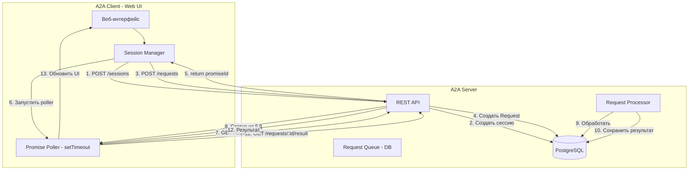
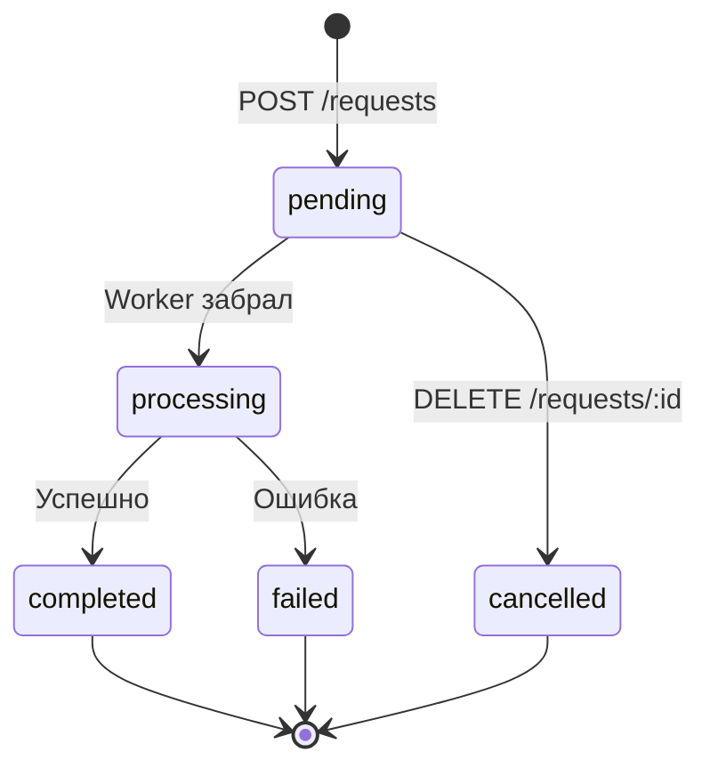
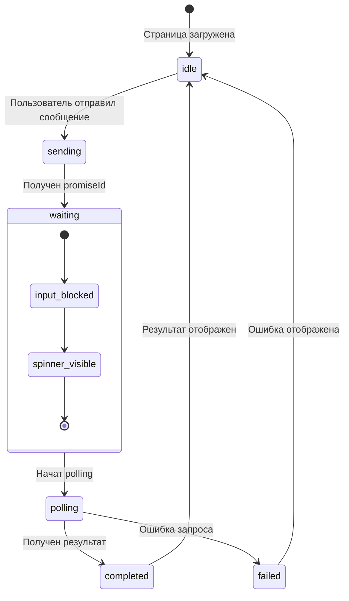

# План: Асинхронный протокол обмена данными

## Ключевые решения

- **Worker на клиенте** - polling делается в веб-приложении через setTimeout/setInterval
- **Хранение на сервере** - все сессии и сообщения в PostgreSQL (никакого localStorage)
- **Только HTTP** - никаких WebSocket, только REST API + polling

---

## Обзор изменений

Переход от синхронного протокола к асинхронному с использованием паттерна Promise/Polling.

### Текущее поведение
```
Клиент -> Сервер: POST /invoke с запросом
Сервер -> Клиент: Результат обработки (синхронно)
```

### Новое поведение
```
Клиент -> Сервер: POST /requests с запросом
Сервер -> Клиент: { promiseId: "xxx" }
... сервер обрабатывает запрос в очереди ...
Клиент -> Сервер: GET /requests/:promiseId/status (polling каждые 5 сек)
Сервер -> Клиент: { status: "pending" | "completed" | "failed" }
Клиент -> Сервер: GET /requests/:promiseId/result (когда completed)
Сервер -> Клиент: { result: {...} }
```

---

## Архитектура



---

## Диаграмма состояний запроса



---

## Диаграмма состояний UI



---

## База данных - Prisma Schema

### Новые модели

```prisma
// Сессия диалога
model Session {
  id          String     @id @default(cuid())
  projectId   String
  status      SessionStatus @default(active)
  createdAt   DateTime   @default(now())
  updatedAt   DateTime   @updatedAt
  messages    Message[]
  requests    Request[]
  
  @@index([projectId])
  @@index([status])
}

enum SessionStatus {
  active
  archived
  deleted
}

// Сообщение в сессии
model Message {
  id          String   @id @default(cuid())
  sessionId   String
  session     Session  @relation(fields: [sessionId], references: [id])
  role        String   // user | server
  content     String
  promiseId   String?  // ссылка на Request для сообщений пользователя
  status      MessageStatus @default(sent)
  createdAt   DateTime @default(now())
  
  @@index([sessionId])
  @@index([promiseId])
}

enum MessageStatus {
  sent
  pending    // ожидает ответа сервера
  completed  // ответ получен
  failed     // ошибка
}

// Запрос на обработку
model Request {
  id          String        @id @default(cuid())
  promiseId   String        @unique @default(cuid())
  sessionId   String?
  session     Session?      @relation(fields: [sessionId], references: [id])
  clientId    String
  status      RequestStatus @default(pending)
  priority    Int           @default(0)
  
  // Входящие данные
  context     Json          // ContextBlock
  message     String?
  codeBlocks  Json?         // FileBlock[]
  
  // Результат
  result      Json?
  error       Json?
  
  // Метаданные
  createdAt   DateTime      @default(now())
  startedAt   DateTime?
  completedAt DateTime?
  
  @@index([status, priority, createdAt])
  @@index([clientId])
  @@index([sessionId])
}

enum RequestStatus {
  pending
  processing
  completed
  failed
  cancelled
}
```

---

## API Endpoints

### Сессии

| Метод | Путь | Описание |
|-------|------|----------|
| POST | /api/v1/sessions | Создать сессию |
| GET | /api/v1/sessions/:id | Получить сессию с сообщениями |
| GET | /api/v1/sessions | Список сессий проекта |
| PATCH | /api/v1/sessions/:id | Обновить сессию |
| DELETE | /api/v1/sessions/:id | Удалить сессию |

### Сообщения

| Метод | Путь | Описание |
|-------|------|----------|
| POST | /api/v1/sessions/:sessionId/messages | Добавить сообщение |
| GET | /api/v1/sessions/:sessionId/messages | Получить сообщения |
| PATCH | /api/v1/messages/:id | Обновить сообщение |

### Запросы (Promise)

| Метод | Путь | Описание |
|-------|------|----------|
| POST | /api/v1/requests | Создать запрос, вернуть promiseId |
| GET | /api/v1/requests/:promiseId/status | Получить статус |
| GET | /api/v1/requests/:promiseId/result | Получить результат |
| DELETE | /api/v1/requests/:promiseId | Отменить запрос |

---

## Файлы для создания/изменения

### Сервер (a2a-server)

| Файл | Действие | Описание |
|------|----------|----------|
| `prisma/schema.prisma` | Изменить | Добавить Session, Message, Request |
| `src/services/session.service.ts` | Создать | CRUD для сессий |
| `src/services/message.service.ts` | Создать | CRUD для сообщений |
| `src/services/request.service.ts` | Создать | Работа с запросами |
| `src/services/queue.service.ts` | Создать | Очередь запросов |
| `src/services/processor.service.ts` | Создать | Обработчик запросов |
| `src/routes/sessions.routes.ts` | Создать | API сессий |
| `src/routes/requests.routes.ts` | Создать | API запросов |
| `src/routes/index.ts` | Изменить | Добавить маршруты |
| `src/types/index.ts` | Изменить | Добавить типы |

### Клиент (a2a-client)

| Файл | Действие | Описание |
|------|----------|----------|
| `packages/api-client/src/index.js` | Изменить | Добавить методы для сессий и запросов |
| `packages/api-client/src/poller.js` | Создать | Класс для polling |
| `web/js/sessions.js` | Изменить | Переписать на серверное хранение |
| `web/js/storage.js` | Удалить/переписать | Убрать localStorage |
| `web/css/style.css` | Изменить | Стили для прелоадера |
| `web/index.html` | Изменить | Добавить элементы UI |

---

## Порядок реализации

### Фаза 1: База данных
- [ ] Обновить `prisma/schema.prisma` - добавить Session, Message, Request
- [ ] Создать миграцию `npx prisma migrate dev`
- [ ] Протестировать схему

### Фаза 2: Серверные сервисы
- [ ] Создать `SessionService` - CRUD для сессий
- [ ] Создать `MessageService` - CRUD для сообщений
- [ ] Создать `RequestService` - создание запросов, получение статуса/результата
- [ ] Создать `QueueService` - очередь запросов
- [ ] Создать `RequestProcessor` - обработчик запросов

### Фаза 3: Серверные маршруты
- [ ] Создать `sessions.routes.ts` - API для сессий
- [ ] Создать `requests.routes.ts` - API для запросов
- [ ] Обновить `routes/index.ts` - подключить маршруты
- [ ] Протестировать API

### Фаза 4: API Client
- [ ] Обновить `ApiClient` - добавить методы для сессий и запросов
- [ ] Создать `PromisePoller` - класс для polling с setTimeout
- [ ] Добавить тесты

### Фаза 5: Веб-интерфейс
- [ ] Переписать `sessions.js` - работа через API
- [ ] Убрать localStorage из `storage.js`
- [ ] Добавить стили для прелоадера
- [ ] Обновить HTML шаблоны
- [ ] Протестировать UI

---

## Детали реализации

### PromisePoller (клиент)

```javascript
class PromisePoller {
  constructor(apiClient, options = {}) {
    this.api = apiClient;
    this.interval = options.interval || 5000; // 5 секунд
    this.activePollers = new Map(); // promiseId -> timerId
  }

  // Начать polling для promiseId
  start(promiseId, callbacks) {
    const poll = async () => {
      const status = await this.api.getRequestStatus(promiseId);
      
      if (status.status === 'completed') {
        const result = await this.api.getRequestResult(promiseId);
        callbacks.onComplete(result);
        this.stop(promiseId);
      } else if (status.status === 'failed') {
        callbacks.onError(status.error);
        this.stop(promiseId);
      } else {
        // Продолжить polling
        const timerId = setTimeout(poll, this.interval);
        this.activePollers.set(promiseId, timerId);
      }
    };
    
    poll();
  }

  // Остановить polling
  stop(promiseId) {
    const timerId = this.activePollers.get(promiseId);
    if (timerId) {
      clearTimeout(timerId);
      this.activePollers.delete(promiseId);
    }
  }
}
```

### UI поведение

1. Пользователь пишет сообщение
2. UI блокирует поле ввода
3. Добавляет сообщение с прелоадером
4. Отправляет запрос на сервер -> получает promiseId
5. Запускает polling для promiseId
6. При получении результата:
   - Обновляет сообщение
   - Убирает прелоадер
   - Разблокирует поле ввода

---

## Удалить

После реализации нужно удалить:
- WebSocket код (`src/websocket/`)
- localStorage использование в веб-интерфейсе
- Старые синхронные методы API
