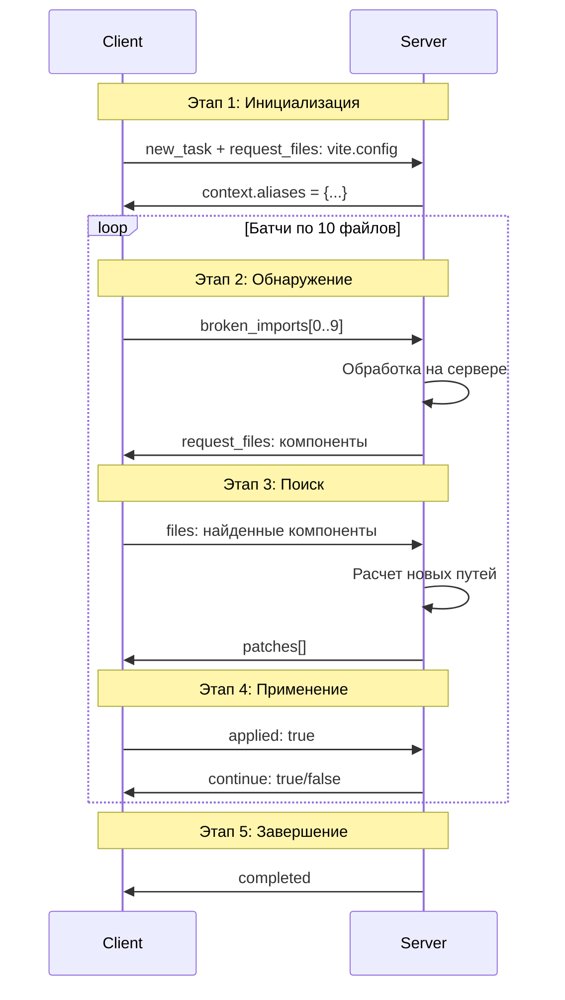
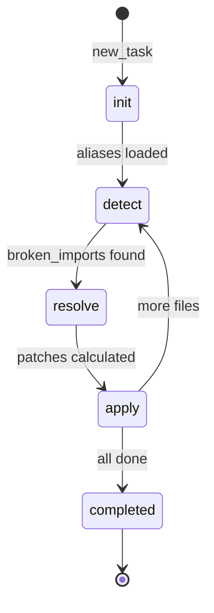

# План: fix-vue-imports-batch - Альтернативный метод с серверной обработкой

## Концепция

**Ключевое отличие от fix-vue-imports:**

| Аспект | fix-vue-imports (текущий) | fix-vue-imports-batch (новый) |
|--------|---------------------------|-------------------------------|
| Где выполняется логика | На клиенте | На сервере |
| Обработка | Все файлы сразу | Батчами по 10 файлов |
| Состояние | Не хранится | В контексте сессии |
| Сервер | Только координирует | Обрабатывает данные |

## Архитектура



## Структура MD файла

Проблема: Как поместить циклическую логику в один MD файл?

**Решение: State Machine на основе контекста**



### Контекстные переменные

```typescript
interface BatchContext {
  // Состояние
  phase: 'init' | 'detect' | 'resolve' | 'apply' | 'completed';
  batchIndex: number;
  batchSize: number;
  
  // Данные
  aliases: Record<string, string>;
  brokenImports: BrokenImport[];
  patches: Patch[];
  fixedFiles: string[];
  totalFiles: number;
  
  // Флаги
  hasMore: boolean;
}
```

## MD файл: fix-vue-imports-batch.md

```markdown
# fix-vue-imports-batch

Исправить сломанные импорты в Vue файлах с серверной обработкой.

## Context

- Framework: Vue 3
- Build tool: Vite
- Processing: Batch mode with server-side logic

## State Machine

Действие использует контекст для определения текущего этапа.

### Переменные контекста

| Переменная | Тип | Описание |
|------------|-----|----------|
| phase | string | Текущий этап: init, detect, resolve, apply, completed |
| batchIndex | number | Индекс текущего батча |
| aliases | object | Алиасы из vite.config |
| brokenImports | array | Найденные сломанные импорты |
| patches | array | Рассчитанные исправления |
| hasMore | boolean | Есть ли еще файлы |

---

## Sub-actions

### 1. batch-init
Инициализация - загрузка конфигурации.

**Condition:** context.phase === undefined OR context.phase === 'init'

**Input:** none  
**Output:** aliases, phase=detect

**Client Code:**
```typescript
// Запрос vite.config
export default async function run(input: { rootDir: string }): Promise<{
  request_files: string[],
  context: { phase: string }
}> {
  return {
    request_files: ['vite.config.ts', 'vite.config.js', 'tsconfig.json'],
    context: { phase: 'init' }
  };
}
```

**Server Processing:**
```typescript
// На сервере при получении файлов
function processConfig(files: FileBlock[]): { aliases: Record<string, string> } {
  const aliases: Record<string, string> = {};
  
  for (const file of files) {
    if (file.path.includes('vite.config')) {
      // Парсинг resolve.alias из vite.config
      const aliasMatch = file.content.match(/alias:\s*{([^}]+)}/s);
      if (aliasMatch) {
        // Извлечение алиасов
        const lines = aliasMatch[1].split('\n');
        for (const line of lines) {
          const match = line.match(/['"]?(@?[^'":]+)['"]?\s*:\s*resolve\(([^)]+)\)/);
          if (match) {
            aliases[match[1]] = match[2];
          }
        }
      }
    }
  }
  
  return { aliases };
}
```

---

### 2. batch-detect
Обнаружение сломанных импортов - батч по 10 файлов.

**Condition:** context.phase === 'detect'

**Input:** aliases  
**Output:** brokenImports[0..9], hasMore

**Client Code:**
```typescript
import { readdirSync, readFileSync, existsSync } from 'node:fs';
import { join, dirname, resolve } from 'node:path';

interface BrokenImport {
  file: string;
  line: number;
  specifier: string;
}

export default async function run(input: { 
  rootDir: string,
  context: { aliases: Record<string, string>, batchIndex: number }
}): Promise<{ 
  broken_imports: BrokenImport[],
  context: { phase: string, hasMore: boolean }
}> {
  const { rootDir, context } = input;
  const batchSize = 10;
  const skip = context.batchIndex * batchSize;
  
  const files = collectFiles(rootDir, ['.ts', '.tsx', '.vue']);
  const broken: BrokenImport[] = [];
  let checked = 0;
  
  for (const file of files) {
    if (checked < skip) { checked++; continue; }
    if (broken.length >= batchSize) break;
    
    const content = readFileSync(file, 'utf-8');
    const lines = content.split('\n');
    
    for (let i = 0; i < lines.length; i++) {
      const line = lines[i];
      const importMatch = line.match(/from\s+['"]([^'"]+)['"]/);
      
      if (importMatch) {
        const spec = importMatch[1];
        if (spec.startsWith('.') && !exists(resolve(dirname(file), spec))) {
          broken.push({ file, line: i + 1, specifier: spec });
        }
      }
    }
    checked++;
  }
  
  return {
    broken_imports: broken,
    context: {
      phase: 'resolve',
      hasMore: checked < files.length
    }
  };
}

function exists(p: string): boolean {
  return existsSync(p) || existsSync(p + '.ts') || existsSync(p + '.vue');
}
```

---

### 3. batch-resolve
Разрешение импортов на сервере.

**Condition:** context.phase === 'resolve'

**Input:** brokenImports  
**Output:** patches, request_files

**Client Code:**
```typescript
export default async function run(input: {
  broken_imports: BrokenImport[],
  context: { aliases: Record<string, string> }
}): Promise<{
  broken_imports: BrokenImport[],
  request_search: { pattern: string, limit: number }[]
}> {
  // Отправляем на сервер, запрашиваем поиск компонентов
  const searchRequests = [];
  
  for (const imp of input.broken_imports) {
    const baseName = imp.specifier.split('/').pop();
    searchRequests.push({
      pattern: `**/${baseName}.{ts,tsx,vue}`,
      limit: 5
    });
  }
  
  return {
    broken_imports: input.broken_imports,
    request_search: searchRequests
  };
}
```

**Server Processing:**
```typescript
// На сервере при получении broken_imports и найденных файлов
function resolveImports(
  brokenImports: BrokenImport[],
  foundFiles: FileBlock[],
  aliases: Record<string, string>
): Patch[] {
  const patches: Patch[] = [];
  
  for (const imp of brokenImports) {
    // Поиск подходящего файла
    const baseName = imp.specifier.split('/').pop();
    const candidates = foundFiles.filter(f => 
      f.path.endsWith(`/${baseName}.ts`) ||
      f.path.endsWith(`/${baseName}.vue`)
    );
    
    if (candidates.length === 1) {
      // Точное совпадение - рассчитываем относительный путь
      const targetPath = candidates[0].path;
      const fromDir = dirname(imp.file);
      const relativePath = relative(fromDir, targetPath);
      
      patches.push({
        file: imp.file,
        line: imp.line,
        from: imp.specifier,
        to: './' + relativePath.replace(/\.(ts|vue)$/, '')
      });
    }
  }
  
  return patches;
}
```

---

### 4. batch-apply
Применение исправлений.

**Condition:** context.phase === 'apply'

**Input:** patches  
**Output:** fixed_files, context

**Client Code:**
```typescript
import { readFileSync, writeFileSync } from 'node:fs';

interface Patch {
  file: string;
  line: number;
  from: string;
  to: string;
}

export default async function run(input: {
  patches: Patch[],
  context: { batchIndex: number, hasMore: boolean }
}): Promise<{
  fixed_files: string[],
  context: { phase: string, batchIndex: number }
}> {
  const { patches, context } = input;
  const fixedFiles: string[] = [];
  
  // Группируем по файлам
  const byFile = groupByFile(patches);
  
  for (const [file, filePatches] of Object.entries(byFile)) {
    let content = readFileSync(file, 'utf-8');
    const lines = content.split('\n');
    
    // Сортируем по убыванию строки
    const sorted = [...filePatches].sort((a, b) => b.line - a.line);
    
    for (const p of sorted) {
      const idx = p.line - 1;
      if (idx >= 0 && idx < lines.length) {
        lines[idx] = lines[idx].replace(p.from, p.to);
      }
    }
    
    writeFileSync(file, lines.join('\n'));
    fixedFiles.push(file);
  }
  
  return {
    fixed_files: fixedFiles,
    context: {
      phase: context.hasMore ? 'detect' : 'completed',
      batchIndex: context.batchIndex + (context.hasMore ? 1 : 0)
    }
  };
}

function groupByFile(patches: Patch[]): Record<string, Patch[]> {
  const map: Record<string, Patch[]> = {};
  for (const p of patches) {
    (map[p.file] ??= []).push(p);
  }
  return map;
}
```

---

### 5. batch-completed
Завершение обработки.

**Condition:** context.phase === 'completed'

**Input:** none  
**Output:** summary

**Client Code:**
```typescript
export default async function run(input: {
  context: { batchIndex: number }
}): Promise<{
  summary: {
    batches_processed: number,
    status: string
  }
}> {
  return {
    summary: {
      batches_processed: input.context.batchIndex,
      status: 'completed'
    }
  };
}
```

---

## Server-Side Logic

### Обработка на сервере

Сервер должен обрабатывать данные между шагами:

```typescript
// В action-processor.ts

function processStepResult(
  stepId: string,
  result: unknown,
  context: BatchContext
): { nextStep: string, context: BatchContext } {
  
  switch (stepId) {
    case 'batch-init':
      // Получили vite.config - извлекаем алиасы
      return {
        nextStep: 'batch-detect',
        context: { ...context, phase: 'detect', aliases: result.aliases }
      };
      
    case 'batch-detect':
      // Получили broken_imports - сохраняем и переходим к resolve
      return {
        nextStep: 'batch-resolve',
        context: { 
          ...context, 
          phase: 'resolve', 
          brokenImports: result.broken_imports,
          hasMore: result.context.hasMore
        }
      };
      
    case 'batch-resolve':
      // Сервер обрабатывает и возвращает patches
      const patches = resolveImports(
        context.brokenImports,
        result.foundFiles,
        context.aliases
      );
      return {
        nextStep: 'batch-apply',
        context: { ...context, phase: 'apply', patches }
      };
      
    case 'batch-apply':
      // После применения проверяем hasMore
      if (context.hasMore) {
        return {
          nextStep: 'batch-detect',
          context: { ...context, phase: 'detect', batchIndex: context.batchIndex + 1 }
        };
      } else {
        return {
          nextStep: 'batch-completed',
          context: { ...context, phase: 'completed' }
        };
      }
      
    default:
      return { nextStep: stepId, context };
  }
}
```

### Выбор шага по контексту

```typescript
function selectStep(context: BatchContext): string {
  switch (context.phase) {
    case 'init':
    case undefined:
      return 'batch-init';
    case 'detect':
      return 'batch-detect';
    case 'resolve':
      return 'batch-resolve';
    case 'apply':
      return 'batch-apply';
    case 'completed':
      return 'batch-completed';
    default:
      return 'batch-init';
  }
}
```

---

## Преимущества подхода

1. **Серверная обработка** - тяжелая логика на сервере
2. **Батчевая обработка** - не перегружаем клиент
3. **Контекстное состояние** - можно продолжить после паузы
4. **Гибкость** - сервер может менять логику без обновления клиента
5. **Масштабируемость** - легко добавить новые типы обработки

---

## Вопросы для обсуждения

1. Нужна ли персистентность контекста между сессиями?
2. Как обрабатывать ошибки в середине батча?
3. Нужен ли прогресс-бар для пользователя?
4. Как синхронизировать состояние если клиент отключился?
