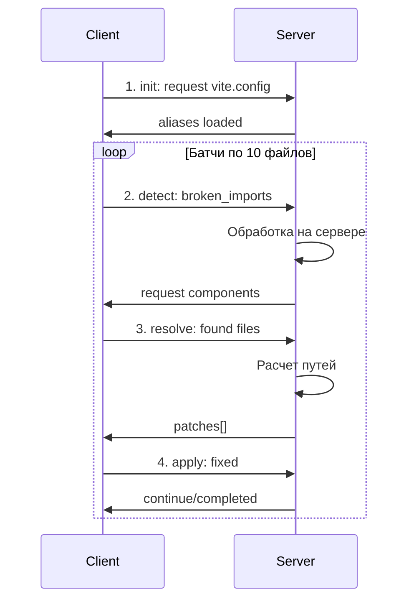
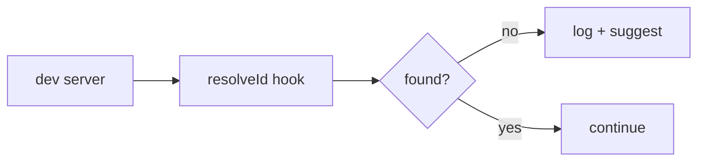

# План: Альтернативные методы fix-vue-imports

## Обзор

Этот документ описывает план по расширению системы альтернативными методами исправления импортов в Vue файлах.

---

## Документы плана

| Документ | Описание |
|----------|----------|
| [fix-vue-imports-batch.md](fix-vue-imports-batch.md) | Батчевая обработка с серверной логикой |
| [fix-vue-imports-alternatives.md](fix-vue-imports-alternatives.md) | Все альтернативные методы |

**Definitions (MD в репо):** [fix-vue-imports.md](../../a2a-server/src/actions/definitions/fix-vue-imports.md) · [fix-vue-imports-batch.md](../../a2a-server/src/actions/definitions/fix-vue-imports-batch.md) · [definitions/README.md](../../a2a-server/src/actions/definitions/README.md)

---

## Текущий метод: fix-vue-imports

**Архитектура:** Клиентское выполнение, линейный поток

**Характеристики:**
- Весь код выполняется на клиенте
- Сервер только координирует
- Один проход по всем файлам
- Нет сохранения состояния

---

## Новый метод: fix-vue-imports-batch

**Архитектура:** Серверная обработка, батчевый режим

**Ключевые отличия:**

| Аспект | fix-vue-imports | fix-vue-imports-batch |
|--------|-----------------|----------------------|
| Где логика | Клиент | Сервер |
| Обработка | Все сразу | Батчи по 10 |
| Состояние | Нет | В контексте |
| Сервер | Координатор | Обработчик |

**Преимущества:**
1. Тяжелая логика на сервере
2. Не перегружаем клиент
3. Можно продолжить после паузы
4. Гибкость на сервере

---

## Другие альтернативные методы

### Method 3: fix-vue-imports-ast (TypeScript Compiler API)

- 100% точность разрешения
- Нативная поддержка tsconfig
- Проверка типов включена

### Method 4: fix-vue-imports-eslint (ESLint)

- Использует существующую инфраструктуру
- IDE интеграция
- Auto-fix поддержка

### Method 5: fix-vue-imports-vite (Vite Plugin)

- Real-time обнаружение
- Интеграция с Vite
- Без отдельной команды

### Method 6: fix-vue-imports-codemod (jscodeshift/ts-morph)

- Мощные трансформации
- Для массовых миграций
- Dry-run режим

---

## Сравнительная таблица

| Метод | Точность | Скорость | Auto-fix | Настройка | Для кого |
|-------|----------|----------|----------|-----------|----------|
| Current (regex) | Средняя | Быстро | Да | Простая | Быстрые исправления |
| Batch | Средняя | Средне | Да | Средняя | Большие проекты |
| AST/TS | Высокая | Медленно | Частично | Сложная | TS проекты |
| ESLint | Высокая | Средне | Частично | Средняя | ESLint пользователи |
| Vite Plugin | Высокая | Real-time | Нет | Простая | Vite проекты |
| Codemod | Высокая | Средне | Да | Сложная | Миграции |

---

## Рекомендации по реализации

### Приоритет

1. **fix-vue-imports-batch** - Высший приоритет
   - Добавляет серверную обработку
   - Расширяет возможности системы
   - Новая архитектура

2. **fix-vue-imports-ast** - Высокий приоритет
   - Максимальная точность для TS проектов

3. **fix-vue-imports-eslint** - Средний приоритет
   - Интеграция с существующим tooling

4. **fix-vue-imports-vite** - Низкий приоритет
   - Только для Vite проектов

5. **fix-vue-imports-codemod** - Низкий приоритет
   - Специфичный use-case

---

## Матрица выбора метода

| Сценарий | Рекомендуемый метод |
|----------|---------------------|
| Быстрое исправление в маленьком проекте | Current (fix-vue-imports) |
| Большой проект с множеством файлов | Batch (fix-vue-imports-batch) |
| TypeScript проект с tsconfig | AST (fix-vue-imports-ast) |
| Уже используется ESLint | ESLint (fix-vue-imports-eslint) |
| Vite проект, нужен real-time | Vite Plugin |
| Массовая миграция/рефакторинг | Codemod |

---

## Следующие шаги

1. **Реализовать fix-vue-imports-batch.md**
   - Создать MD файл с sub-actions
   - Добавить серверную логику обработки
   - Реализовать state machine на контексте

2. **Добавить поддержку условий в action-parser**
   - Парсинг `**Condition:**` в MD
   - Выбор шага по контексту

3. **Расширить ServerMessage типы**
   - Добавить `request_search`
   - Добавить серверные вычисления

---

## Вопросы для обсуждения

1. Какой метод реализовать первым после batch?
2. Нужна ли персистентность контекста между сессиями?
3. Как обрабатывать ошибки в середине батча?
4. Нужен ли прогресс-бар для пользователя?
