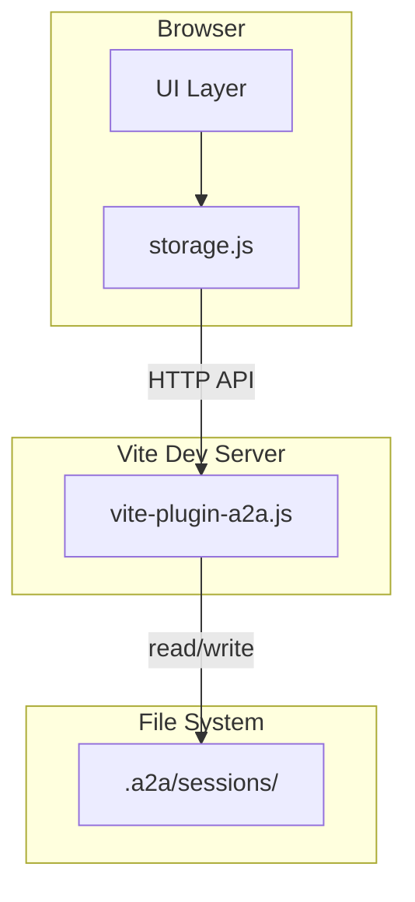

# Миграция: localStorage → .a2a папка проекта

**Статус: выполнено** (2026-02-20)

## Проблема

В текущей реализации [`storage.js`](../a2a-client/web/js/storage.js) используется localStorage для:
- `getCurrentProjectId()` / `setCurrentProject()` — текущий проект
- `getSessions()` / `saveSession()` / `getSession()` — сессии

Это противоречит архитектуре: данные должны храниться в `.a2a` папке проекта.

---

## Решение

Расширить [`vite-plugin-a2a.js`](../a2a-client/vite-plugin-a2a.js) для работы с сессиями через API.

---

## Структура данных

```
project/
├── .a2a/
│   ├── index.json          # Индекс проекта
│   ├── config.json         # Конфигурация проекта
│   └── sessions/
│       ├── sess_1.json     # Сессия с сообщениями
│       └── sess_2.json
```

### Формат файла сессии

```json
{
  "id": "sess_1",
  "projectId": "proj_1",
  "title": "New Session",
  "createdAt": "2026-02-20T...",
  "updatedAt": "2026-02-20T...",
  "messages": [
    {
      "id": "msg_1",
      "role": "user",
      "content": "Hello",
      "promiseId": "prm_xxx",
      "status": "pending",
      "createdAt": "2026-02-20T..."
    }
  ]
}
```

---

## API Endpoints для vite-plugin

| Метод | Путь | Описание |
|-------|------|----------|
| GET | `/api/a2a/projects/:id/sessions` | Получить список сессий |
| POST | `/api/a2a/projects/:id/sessions` | Создать сессию |
| GET | `/api/a2a/projects/:id/sessions/:sessionId` | Получить сессию |
| PUT | `/api/a2a/projects/:id/sessions/:sessionId` | Обновить сессию |
| DELETE | `/api/a2a/projects/:id/sessions/:sessionId` | Удалить сессию |

### GET /api/a2a/projects/:id/sessions

```json
{
  "sessions": [
    { "id": "sess_1", "title": "Session 1", "createdAt": "..." },
    { "id": "sess_2", "title": "Session 2", "createdAt": "..." }
  ]
}
```

### POST /api/a2a/projects/:id/sessions

Request:
```json
{
  "title": "New Session"
}
```

Response:
```json
{
  "success": true,
  "session": {
    "id": "sess_xxx",
    "title": "New Session",
    "createdAt": "...",
    "messages": []
  }
}
```

### GET /api/a2a/projects/:id/sessions/:sessionId

```json
{
  "id": "sess_1",
  "title": "Session 1",
  "createdAt": "...",
  "messages": [...]
}
```

### PUT /api/a2a/projects/:id/sessions/:sessionId

Request:
```json
{
  "title": "Updated Title",
  "messages": [...]
}
```

Response:
```json
{
  "success": true,
  "session": { ... }
}
```

### DELETE /api/a2a/projects/:id/sessions/:sessionId

```json
{
  "success": true
}
```

---

## Текущий проект

Для хранения текущего проекта использовать cookie вместо localStorage:

```javascript
// В storage.js
getCurrentProjectId() {
  return document.cookie
    .split('; ')
    .find(row => row.startsWith('a2a_currentProject='))
    ?.split('=')[1] || null;
}

setCurrentProject(id) {
  if (id) {
    document.cookie = `a2a_currentProject=${id}; path=/; max-age=31536000`;
  } else {
    document.cookie = 'a2a_currentProject=; path=/; max-age=0';
  }
}
```

---

## Диаграмма



---

## Задачи

### 1. Расширить vite-plugin-a2a.js

Добавить обработку новых endpoints:
- [x] GET `/projects/:id/sessions` — список сессий
- [x] POST `/projects/:id/sessions` — создать сессию
- [x] GET `/projects/:id/sessions/:sessionId` — получить сессию
- [x] PUT `/projects/:id/sessions/:sessionId` — обновить сессию
- [x] DELETE `/projects/:id/sessions/:sessionId` — удалить сессию

Вспомогательные функции:
- [x] `getSessionsDir(projectPath)` — путь к папке сессий
- [x] `listSessions(projectPath)` — список сессий
- [x] `loadSession(projectPath, sessionId)` — загрузить сессию
- [x] `saveSession(projectPath, session)` — сохранить сессию
- [x] `deleteSession(projectPath, sessionId)` — удалить сессию

### 2. Обновить storage.js

- [x] Заменить `getCurrentProjectId()` на cookie
- [x] Заменить `setCurrentProject()` на cookie
- [x] Переписать `getSessions()` на API
- [x] Переписать `saveSession()` на API
- [x] Переписать `getSession()` на API
- [x] Добавить `deleteSession()` через API
- [x] Сделать все методы async

### 3. Обновить callers

Файлы, которые используют Storage:
- [x] `web/js/sessions.js` — использует /api/v1 (сервер), Storage для проектов
- [x] `web/js/projects.js` — getCurrentProjectId sync (cookie)

### 4. Обновить документацию

- [x] Убрать упоминания localStorage из TODO.md
- [x] Убрать упоминания localStorage из a2a-client/TODO.md
- [x] Убрать упоминания localStorage из plans/async-protocol-change.md

---

## Преимущества

1. **Персистентность** — данные сохраняются в файлах, а не в браузере
2. **Переносимость** — сессии привязаны к проекту, а не к браузеру
3. **Git-friendly** — можно коммитить сессии в репозиторий
4. **Консистентность** — единый подход к хранению всех данных проекта
