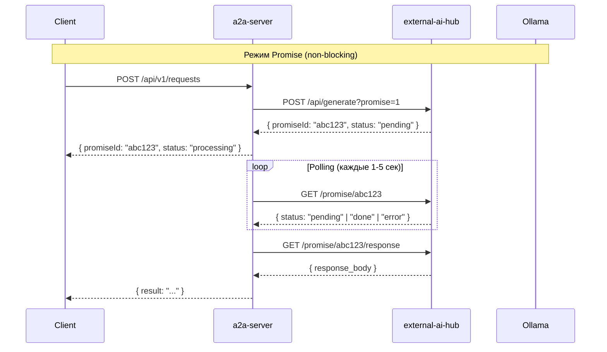

# План: Интеграция a2a-server с external-ai-hub (Ollama Proxy) в режиме Promise

## Текущее состояние

### external-ai-hub (proxy.py)
Уже имеет promise-based систему:
- **Порт**: 11434 (где ожидается Ollama)
- **Target**: 11435 (реальная Ollama)
- **Promise режим**: `?promise=1` в запросе
- **API для проверки статуса**:
  - `GET /promise/<promise_id>` — статус промиса
  - `GET /promise/<promise_id>/response` — получить ответ

### a2a-server (llm-adapter.ts)
Текущая реализация:
- Синхронный вызов OpenAI API
- Блокирующий await fetch()
- Нет интеграции с external-ai-hub

### Проблема
- При запросе к Ollama сервер **зависает** на время генерации
- Нет асинхронного режима
- Нет polling механизма

---

## Цель

Создать интеграцию, которая:
1. Отправляет запросы в external-ai-hub с `?promise=1`
2. Возвращает **promiseId** сразу (не блокируется)
3. Периодически **ping-ует** external-ai-hub на статус
4. Получает ответ когда он готов

---

## Архитектура



---

## План реализации

### Этап 1: Настройка external-ai-hub

1. Запустить external-ai-hub на порту 11434:
   ```bash
   cd external-ai-hub
   python proxy.py
   ```

2. Настроить переменные окружения:
   ```bash
   export OLLAMA_HOST=http://localhost:11435  # Реальная Ollama
   export PROXY_PORT=11434
   export PROMISE_TTL_SECONDS=3600
   ```

### Этап 2: Создание OllamaAdapter

Создать `src/services/ollama-adapter.ts`:

```typescript
import { logger } from '../utils/logger.js';

const AI_HUB_URL = process.env.AI_HUB_URL || 'http://localhost:11434';
const POLL_INTERVAL_MS = parseInt(process.env.POLL_INTERVAL_MS || '2000');
const POLL_TIMEOUT_MS = parseInt(process.env.POLL_TIMEOUT_MS || '120000');

export interface OllamaRequest {
  model: string;
  prompt?: string;
  messages?: Array<{ role: string; content: string }>;
  stream?: boolean;
}

export interface PromiseStatus {
  promiseId: string;
  status: 'pending' | 'done' | 'error';
  error?: string;
}

/**
 * Отправить запрос в external-ai-hub в режиме promise
 * Возвращает promiseId сразу (non-blocking)
 */
export async function createOllamaPromise(request: OllamaRequest): Promise<{ promiseId: string }> {
  const response = await fetch(`${AI_HUB_URL}/api/generate?promise=1`, {
    method: 'POST',
    headers: { 'Content-Type': 'application/json' },
    body: JSON.stringify({
      model: request.model,
      prompt: request.prompt,
      messages: request.messages,
      stream: false
    })
  });

  if (!response.ok) {
    throw new Error(`AI Hub error: ${response.status}`);
  }

  const data = await response.json();
  return { promiseId: data.promiseId };
}

/**
 * Проверить статус промиса
 */
export async function getPromiseStatus(promiseId: string): Promise<PromiseStatus> {
  const response = await fetch(`${AI_HUB_URL}/promise/${promiseId}`);
  
  if (response.status === 404) {
    throw new Error(`Promise not found: ${promiseId}`);
  }
  
  return response.json();
}

/**
 * Получить результат промиса
 */
export async function getPromiseResponse(promiseId: string): Promise<Response> {
  return fetch(`${AI_HUB_URL}/promise/${promiseId}/response`);
}

/**
 * Ждать результат с polling
 * Возвращает текст ответа
 */
export async function waitForPromise(
  promiseId: string,
  onProgress?: (status: PromiseStatus) => void
): Promise<string> {
  const startTime = Date.now();
  
  while (Date.now() - startTime < POLL_TIMEOUT_MS) {
    const status = await getPromiseStatus(promiseId);
    
    if (onProgress) {
      onProgress(status);
    }
    
    if (status.status === 'done') {
      const response = await getPromiseResponse(promiseId);
      return await response.text();
    }
    
    if (status.status === 'error') {
      throw new Error(status.error || 'Promise failed');
    }
    
    // pending - ждем следующего polling
    await new Promise(resolve => setTimeout(resolve, POLL_INTERVAL_MS));
  }
  
  throw new Error('Promise timeout');
}
```

### Этап 3: Интеграция с LLM Adapter

Модифицировать `src/services/llm-adapter.ts`:

```typescript
import { createOllamaPromise, waitForPromise } from './ollama-adapter.js';

// Конфигурация
const USE_OLLAMA = process.env.USE_OLLAMA === 'true';
const OLLAMA_MODEL = process.env.OLLAMA_MODEL || 'llama2';

/**
 * Определить какой LLM использовать
 */
function getLLMType(): 'ollama' | 'openai' | 'placeholder' {
  if (USE_OLLAMA) return 'ollama';
  if (process.env.OPENAI_API_KEY) return 'openai';
  return 'placeholder';
}

/**
 * Call LLM - теперь поддерживает Ollama в режиме promise
 */
export async function callLLM(input: LLMInput): Promise<string> {
  const llmType = getLLMType();
  
  switch (llmType) {
    case 'ollama':
      return callOllama(input);
    case 'openai':
      return callOpenAI(input);
    default:
      return PLACEHOLDER;
  }
}

async function callOllama(input: LLMInput): Promise<string> {
  const prompt = buildPrompt(input);
  
  // Создаем promise (сразу возвращает promiseId)
  const { promiseId } = await createOllamaPromise({
    model: OLLAMA_MODEL,
    prompt,
    stream: false
  });
  
  logger.info(`[Ollama] Promise created: ${promiseId}`);
  
  // Ждем результат с polling
  const result = await waitForPromise(promiseId, (status) => {
    logger.info(`[Ollama] Promise status: ${status.status}`);
  });
  
  return result;
}
```

### Этап 4: Promise Pool (опционально)

Для обработки множественных запросов создать `src/services/promise-pool.ts`:

```typescript
import { createOllamaPromise, getPromiseStatus, getPromiseResponse } from './ollama-adapter.js';

interface PendingPromise {
  promiseId: string;
  resolve: (value: string) => void;
  reject: (error: Error) => void;
  startTime: number;
}

class OllamaPromisePool {
  private promises = new Map<string, PendingPromise>();
  private pollInterval: NodeJS.Timeout | null = null;
  
  /**
   * Добавить запрос в пул
   */
  async add(request: { model: string; prompt: string }): Promise<string> {
    const { promiseId } = await createOllamaPromise(request);
    
    return new Promise((resolve, reject) => {
      this.promises.set(promiseId, {
        promiseId,
        resolve,
        reject,
        startTime: Date.now()
      });
    });
  }
  
  /**
   * Запустить polling цикл
   */
  startPolling(intervalMs: number = 2000): void {
    this.pollInterval = setInterval(async () => {
      for (const [id, pending] of this.promises) {
        try {
          const status = await getPromiseStatus(id);
          
          if (status.status === 'done') {
            const response = await getPromiseResponse(id);
            const text = await response.text();
            pending.resolve(text);
            this.promises.delete(id);
          } else if (status.status === 'error') {
            pending.reject(new Error(status.error));
            this.promises.delete(id);
          }
        } catch (e) {
          pending.reject(e as Error);
          this.promises.delete(id);
        }
      }
    }, intervalMs);
  }
  
  stopPolling(): void {
    if (this.pollInterval) {
      clearInterval(this.pollInterval);
      this.pollInterval = null;
    }
  }
}

export const ollamaPool = new OllamaPromisePool();
```

### Этап 5: Конфигурация

Добавить в `.env`:

```bash
# AI Hub (Ollama Proxy)
USE_OLLAMA=true
AI_HUB_URL=http://localhost:11434
OLLAMA_MODEL=llama2
POLL_INTERVAL_MS=2000
POLL_TIMEOUT_MS=120000

# Fallback на OpenAI
# OPENAI_API_KEY=sk-...
```

---

## Файлы для создания/изменения

| Файл | Изменение |
|------|-----------|
| `src/services/ollama-adapter.ts` | **Создать** - основной адаптер |
| `src/services/promise-pool.ts` | **Создать** - пул промисов |
| `src/services/llm-adapter.ts` | **Изменить** - добавить Ollama |
| `.env.example` | **Изменить** - добавить переменные |
| `tests/ollama-adapter.test.ts` | **Создать** - тесты |

---

## API Endpoints (расширение)

После интеграции будут доступны:

```typescript
// В external-ai-hub
GET  /promise/:id          // Статус
GET  /promise/:id/response // Результат

// В a2a-server (если нужно)
GET  /api/v1/ollama/status/:promiseId // Прокси статус
```

---

## Мониторинг и логирование

```typescript
// Логирование
logger.info('[Ollama] Creating promise', { model, promptLength });
logger.info('[Ollama] Promise done', { promiseId, durationMs });
logger.warn('[Ollama] Promise timeout', { promiseId });
logger.error('[Ollama] Promise error', { promiseId, error });
```

---

## Тестирование

```bash
# Запуск external-ai-hub
cd external-ai-hub && python proxy.py &

# Запуск a2a-server
cd a2a-server && npm run dev

# Тест
curl -X POST http://localhost:3000/api/v1/requests \
  -H "Content-Type: application/json" \
  -d '{"context": {"new_task": "тест"}}'
```

---

## Приоритеты реализации

1. **Этап 1-2**: Базовая интеграция с OllamaAdapter (высокий)
2. **Этап 3**: Интеграция в LLM Adapter (высокий)
3. **Этап 4**: Promise Pool для множественных запросов (средний)
4. **Этап 5**: Конфигурация и мониторинг (низкий)

---

## Риски

1. **Timeout**: При долгой генерации - настроить POLL_TIMEOUT_MS
2. **Ollama недоступна**: fallback на placeholder
3. **Network errors**: retry логика в polling
4. **Memory**: Очистка старых промисов

---

## Дата
2026-02-24

## Статус
Черновик для обсуждения
