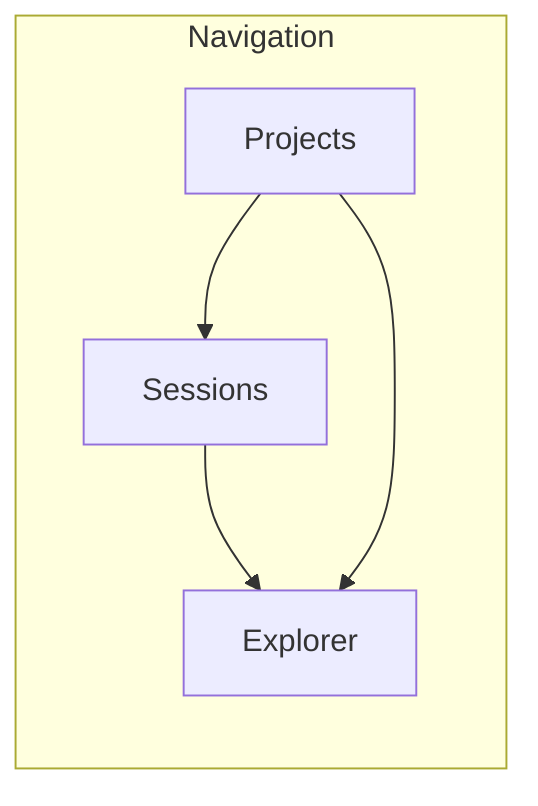
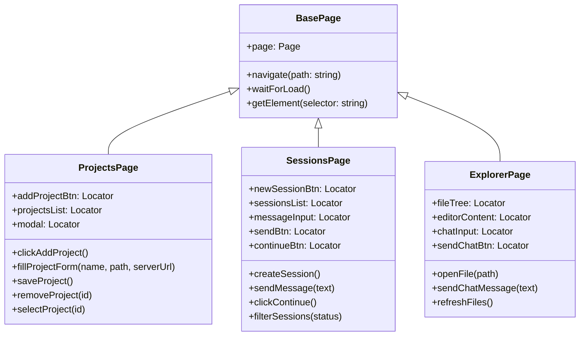
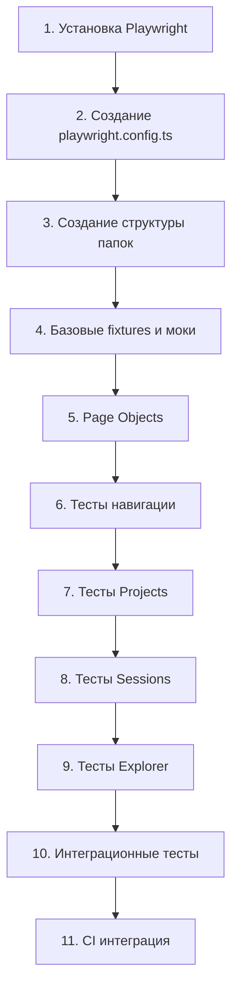

# План: Playwright E2E тесты для a2a-client/web/

## 1. Обзор проекта

### Web-интерфейс
Web-приложение расположено в [`a2a-client/web/`](a2a-client/web/) и состоит из:

| Файл | Описание |
|------|----------|
| [`index.html`](a2a-client/web/index.html) | Главная страница с 3 секциями |
| [`js/app.js`](a2a-client/web/js/app.js) | Ядро приложения, навигация, API |
| [`js/projects.js`](a2a-client/web/js/projects.js) | Управление проектами |
| [`js/sessions.js`](a2a-client/web/js/sessions.js) | Управление сессиями |
| [`js/explorer.js`](a2a-client/web/js/explorer.js) | Файловый браузер + чат |

### Страницы приложения



---

## 2. Архитектура тестов

### Структура папок

```
a2a-client/
├── e2e/
│   ├── fixtures/
│   │   └── test-fixtures.ts       # Кастомные fixtures
│   ├── mocks/
│   │   └── api-mocks.ts           # Моки API ответов
│   ├── pages/
│   │   ├── base.page.ts           # Базовая page object
│   │   ├── projects.page.ts       # Page object для Projects
│   │   ├── sessions.page.ts       # Page object для Sessions
│   │   └── explorer.page.ts       # Page object для Explorer
│   ├── tests/
│   │   ├── navigation.spec.ts     # Тесты навигации
│   │   ├── projects.spec.ts       # Тесты Projects
│   │   ├── sessions.spec.ts       # Тесты Sessions
│   │   ├── explorer.spec.ts       # Тесты Explorer
│   │   └── integration.spec.ts    # Интеграционные сценарии
│   └── utils/
│       └── helpers.ts             # Вспомогательные функции
├── playwright.config.ts           # Конфигурация Playwright
└── package.json                   # Зависимости
```

### Page Object Model



---

## 3. Сценарии тестов

### 3.1 Навигация (navigation.spec.ts)

| ID | Тест | Описание |
|----|------|----------|
| NAV-01 | Should load app and show Projects page by default | При загрузке отображается страница Projects |
| NAV-02 | Should navigate to Sessions page | Клик по ссылке Sessions переключает страницу |
| NAV-03 | Should navigate to Explorer page | Клик по ссылке Explorer переключает страницу |
| NAV-04 | Should update active nav link | Активная ссылка подсвечивается |
| NAV-05 | Should display connection status | Статус подключения отображается в header |

### 3.2 Projects (projects.spec.ts)

| ID | Тест | Описание |
|----|------|----------|
| PRJ-01 | Should display empty state when no projects | Сообщение "No projects. Click + Add" |
| PRJ-02 | Should open Add Project modal | Модальное окно открывается по клику + Add |
| PRJ-03 | Should close modal on Cancel | Модальное окно закрывается по Cancel |
| PRJ-04 | Should close modal on X button | Модальное окно закрывается по кнопке X |
| PRJ-05 | Should close modal on backdrop click | Модальное окно закрывается по клику вне окна |
| PRJ-06 | Should validate required fields | Нельзя сохранить без Name и Path |
| PRJ-07 | Should create new project | Проект создаётся и появляется в списке |
| PRJ-08 | Should display project cards | Карточки проектов отображаются корректно |
| PRJ-09 | Should select project and navigate to Sessions | Выбор проекта переключает на Sessions |
| PRJ-10 | Should trigger index build | Кнопка Index отправляет запрос |
| PRJ-11 | Should remove project with confirmation | Проект удаляется после подтверждения |
| PRJ-12 | Should display project stats | Показывается количество files и sessions |

### 3.3 Sessions (sessions.spec.ts)

| ID | Тест | Описание |
|----|------|----------|
| SES-01 | Should show empty state without project | Сообщение "Select a project first" |
| SES-02 | Should create new session | Кнопка + New создаёт сессию |
| SES-03 | Should display session list | Список сессий отображается |
| SES-04 | Should filter sessions by status | Фильтр All/Active/Waiting/Done работает |
| SES-05 | Should open existing session | Клик по сессии открывает её |
| SES-06 | Should send message | Сообщение отправляется и отображается |
| SES-07 | Should send message on Enter | Enter отправляет сообщение |
| SES-08 | Should click Continue button | Кнопка Делаем отправляет continue:true |
| SES-09 | Should display messages in correct order | Сообщения отображаются в хронологическом порядке |
| SES-10 | Should display session status | Статус сессии отображается в header |
| SES-11 | Should poll for updates | Polling работает для обновлений |
| SES-12 | Should format code blocks | Блоки кода форматируются правильно |

### 3.4 Explorer (explorer.spec.ts)

| ID | Тест | Описание |
|----|------|----------|
| EXP-01 | Should show empty state without files | Сообщение "No files. Build index." |
| EXP-02 | Should display file tree | Дерево файлов отображается |
| EXP-03 | Should open file in editor | Клик по файлу открывает содержимое |
| EXP-04 | Should highlight selected file | Выбранный файл подсвечивается |
| EXP-05 | Should refresh file tree | Кнопка Refresh обновляет список |
| EXP-06 | Should send chat message | Сообщение в чат отправляется |
| EXP-07 | Should send chat on Enter | Enter отправляет сообщение чата |
| EXP-08 | Should display chat messages | Сообщения чата отображаются |

### 3.5 Интеграционные тесты (integration.spec.ts)

| ID | Тест | Описание |
|----|------|----------|
| INT-01 | Full workflow: create project, session, send message | Полный цикл работы |
| INT-02 | Build index and view files | Индексация и просмотр файлов |
| INT-03 | Switch between projects | Переключение между проектами |
| INT-04 | Session polling with server updates | Polling при обновлениях сервера |

---

## 4. API моки

### Эндпоинты для мокирования

```typescript
// mocks/api-mocks.ts
const apiMocks = {
  // Status
  'GET /api/status': { status: 'ok', indexStatus: 'ready' },
  
  // Projects
  'GET /api/projects': { data: { projects: [] } },
  'POST /api/projects': { id: 'proj-123', name: 'Test Project' },
  'GET /api/projects/:id': { id: 'proj-123', name: 'Test Project', path: '/test' },
  'PUT /api/projects/:id': { success: true },
  'DELETE /api/projects/:id': { success: true },
  'POST /api/projects/:id/select': { success: true },
  'POST /api/projects/:id/index': { success: true },
  
  // Sessions
  'GET /api/sessions': { sessions: [] },
  'POST /api/sessions': { session_id: 'sess-123', status: 'active' },
  'GET /api/sessions/:id': { id: 'sess-123', status: 'active', messages: [] },
  'POST /api/sessions/:id/messages': { success: true },
  'POST /api/sessions/:id/continue': { success: true },
  'GET /api/sessions/:id/updates': { messages: [], status: 'active' },
  
  // Files
  'GET /api/files': { files: ['src/index.js', 'src/app.js'] },
  'GET /api/files/*': { content: 'file content here' },
  
  // Chat
  'POST /api/chat': { success: true },
  
  // Index
  'POST /api/index/build': { success: true }
};
```

---

## 5. Конфигурация Playwright

```typescript
// playwright.config.ts
import { defineConfig, devices } from '@playwright/test';

export default defineConfig({
  testDir: './e2e/tests',
  fullyParallel: true,
  forbidOnly: !!process.env.CI,
  retries: process.env.CI ? 2 : 0,
  workers: process.env.CI ? 1 : undefined,
  reporter: 'html',
  use: {
    baseURL: 'http://localhost:5173',
    trace: 'on-first-retry',
    screenshot: 'only-on-failure',
  },
  projects: [
    {
      name: 'chromium',
      use: { ...devices['Desktop Chrome'] },
    },
  ],
  webServer: {
    command: 'npx serve web -l 5173',
    cwd: './a2a-client',
    url: 'http://localhost:5173',
    reuseExistingServer: !process.env.CI,
  },
});
```

---

## 6. Зависимости

### package.json additions

```json
{
  "devDependencies": {
    "@playwright/test": "^1.40.0",
    "@types/node": "^20.10.0"
  },
  "scripts": {
    "test:e2e": "playwright test",
    "test:e2e:ui": "playwright test --ui",
    "test:e2e:debug": "playwright test --debug",
    "test:e2e:report": "playwright show-report"
  }
}
```

---

## 7. Порядок реализации



---

## 8. Критерии приёмки

- [ ] Все тесты проходят в Chrome
- [ ] Покрытие основных user flows
- [ ] Моки API работают корректно
- [ ] Тесты стабильные (нет flaky тестов)
- [ ] HTML отчёт генерируется
- [ ] Скрипты добавлены в package.json
