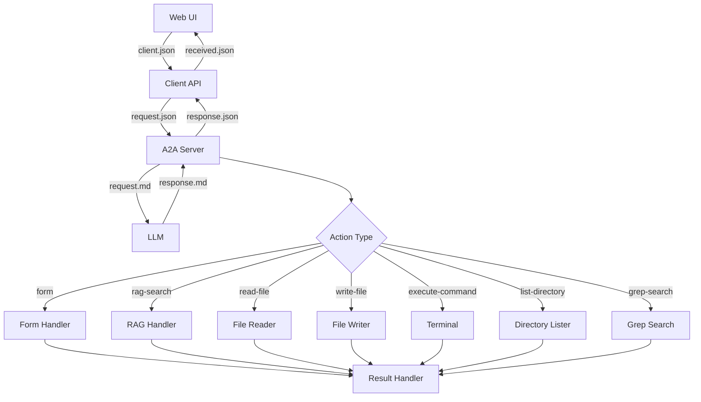

# План расширения протоколов обмена A2A

## Текущее состояние

В проекте существуют следующие протоколы обмена:

### 1. Основные директории с протоколами
- `docs/new-request-flow/json-schemas/` - JSON схемы (8 файлов)
- `schemas/protocol/` - Схемы протокола (6 файлов)
- `simulations/` - Симуляции сценариев (12 директорий)

### 2. Существующие типы действий (actions)

| Тип | Статус | Описание |
|-----|--------|----------|
| `form` | ✅ Реализовано | Интерактивные формы с choices и input |
| `rag-search` | ✅ Реализовано | RAG поиск с результатами |
| `read-file` | ✅ Реализовано | Чтение содержимого файла |
| `write-file` | ✅ Реализовано | Запись данных в файл |
| `execute-command` | ✅ Реализовано | Выполнение shell команд |
| `script` | ✅ Реализовано | Выполнение JavaScript в sandbox |
| `message` | ✅ Реализовано | Отображение сообщений (UI only) |

### 3. Запланированные но нереализованные типы действий

| Тип | Статус | Описание |
|-----|--------|----------|
| `list-directory` | 🔶 Частично | Требует полной реализации |
| `grep-search` | ❌ Не реализовано | Текстовый поиск по файлам |
| `file-exists` | ❌ Не реализовано | Проверка существования файла |
| `scan-directory` | 🔶 Частично | Сканирование директорий по шаблону |
| `edit-patch` | ❌ Не реализовано | Применение патча к файлу |
| `run-script` | ❌ Не реализовано | Запуск предопределенных скриптов |

---

## Этапы протокола обмена

### Этап 1: Инициация запроса
- **Направление**: Web → Client API
- **Файлы**: `client.json`
- **Содержимое**: `{ task, projectId }`

### Этап 2: Маршрутизация (Роутинг)
- **Направление**: Server → Client API → Web
- **Файлы**: `response.json`, `received.json`
- **Тип**: `execute.form.choices` - выбор действия

### Этап 3: Выполнение действия
- **Направление**: Bidirectional
- **Файлы**: `request.json`, `response.json`, `request.md`, `response.md`
- **Типы**: Все существующие action типы

### Этап 4: Возврат результата
- **Направление**: Client → Server
- **Файлы**: `request.json` (с result)
- **Формат**: Action-key shape

### Этап 5: Завершение
- **Статус**: `context.execution.status = "completed"`

---

## План расширения

### Фаза 1: Расширение типов действий

#### 1.1 Добавить `list-directory` в схемы
- [ ] Обновить `schemas/action-types.schema.json`
- [ ] Обновить `docs/new-request-flow/json-schemas/`
- [ ] Реализовать в `a2a-client/packages/execution/`

#### 1.2 Добавить `grep-search`
- [ ] Создать схему в `schemas/`
- [ ] Добавить реализацию в `a2a-client/packages/execution/`
- [ ] Создать тестовую симуляцию

#### 1.3 Добавить `file-exists`
- [ ] Создать схему
- [ ] Реализовать функцию проверки
- [ ] Интегрировать с LLM

#### 1.4 Добавить `scan-directory`
- [ ] Расширить существующий FileScanner
- [ ] Добавить в схемы

#### 1.5 Добавить `edit-patch`
- [ ] Создать схему для patch формата
- [ ] Реализовать применение патчей

#### 1.6 Добавить `run-script`
- [ ] Определить формат предопределенных скриптов
- [ ] Реализовать registry скриптов

### Фаза 2: Расширение протоколов управления сессиями

#### 2.1 Новые endpoints для сессий
- [ ] Session Pause/Resume - приостановка и возобновление
- [ ] Session Clone - клонирование сессии
- [ ] Session Export/Import - экспорт/импорт
- [ ] Session History - история изменений
- [ ] Session Notes - пользовательские заметки
- [ ] Batch Operations - групповые операции

#### 2.2 Новые endpoints для проектов
- [ ] Project Clone - клонирование проекта
- [ ] Project Export/Import - экспорт/импорт
- [ ] Project Settings - настройки проекта

#### 2.3 Communication расширения
- [ ] WebSocket Connection - постоянное соединение
- [ ] Real-time Typing - индикация набора
- [ ] Push Notifications - push уведомления

#### 2.4 Схемы для новых протоколов
- [ ] Создать `schemas/session-actions.schema.json`
- [ ] Создать `schemas/project-actions.schema.json`
- [ ] Обновить `schemas/protocol/`

#### 2.1 Создать новые симуляции
- [ ] `list-directory` симуляция
- [ ] `grep-search` симуляция
- [ ] `file-operations` симуляция (объединенная)

### Фаза 3: Документирование этапов

#### 3.1 Создать отдельные файлы для каждого этапа
- [ ] `docs/new-request-flow/STAGES/01-initiation.md`
- [ ] `docs/new-request-flow/STAGES/02-routing.md`
- [ ] `docs/new-request-flow/STAGES/03-execution.md`
- [ ] `docs/new-request-flow/STAGES/04-result.md`
- [ ] `docs/new-request-flow/STAGES/05-completion.md`

---

## Примеры расширенных протоколов

### Пример: list-directory

**Execute (Server → Client):**
```json
{
  "execute": {
    "list-directory": {
      "path": "src/",
      "pattern": "*.ts"
    }
  }
}
```

**Result (Client → Server):**
```json
{
  "result": {
    "list-directory": {
      "path": "src/",
      "entries": [
        { "name": "index.ts", "type": "file" },
        { "name": "utils", "type": "dir" }
      ]
    }
  }
}
```

### Пример: grep-search

**Execute:**
```json
{
  "execute": {
    "grep-search": {
      "pattern": "function\\s+\\w+",
      "path": "src/",
      "glob": "*.ts"
    }
  }
}
```

**Result:**
```json
{
  "result": {
    "grep-search": {
      "matches": [
        { "file": "src/index.ts", "line": 10, "text": "function hello()" },
        { "file": "src/utils.ts", "line": 5, "text": "function parse()" }
      ]
    }
  }
}
```

---

## Mermaid: Полный поток протокола



---

## Рекомендации по реализации

1. **Приоритет**: Начать с `list-directory` и `grep-search` - наиболее востребованные для LLM операции
2. **Совместимость**: Все новые типы должны следовать action-key shape
3. **Тестирование**: Создавать симуляции для каждого нового типа
4. **Документация**: Обновлять `simulations/auto-ai/ACTIONS-MAP.md` при добавлении
5. **Сессии**: Использовать `plans/session-management-protocols.md` для управления сессиями

---

## Расширение UI Commands

### Проблема
- Web UI сам решает что показать (spinner, loading)
- Client API не управляет UI состоянием
- При загрузке страницы - быстро, но сессии грузятся долго

### Решение
Добавить `execute.ui` команды:

```json
{
  "execute": {
    "ui": {
      "state": "waiting",
      "message": "AI обрабатывает...",
      "progress": 50,
      "spinner": true
    }
  }
}
```

### Типы UI состояний

| State | Описание |
|-------|----------|
| `idle` | Ожидание ввода |
| `loading` | Загрузка |
| `waiting` | Ожидание Promise |
| `processing` | Обработка |
| `error` | Ошибка |
| `success` | Успех |

### Новые файлы

- [`docs/new-request-flow/json-schemas/UI-COMMANDS.md`](docs/new-request-flow/json-schemas/UI-COMMANDS.md)
- [`docs/new-request-flow/STAGES/simulations/PROMISE-WAITING.md`](docs/new-request-flow/STAGES/simulations/PROMISE-WAITING.md)
