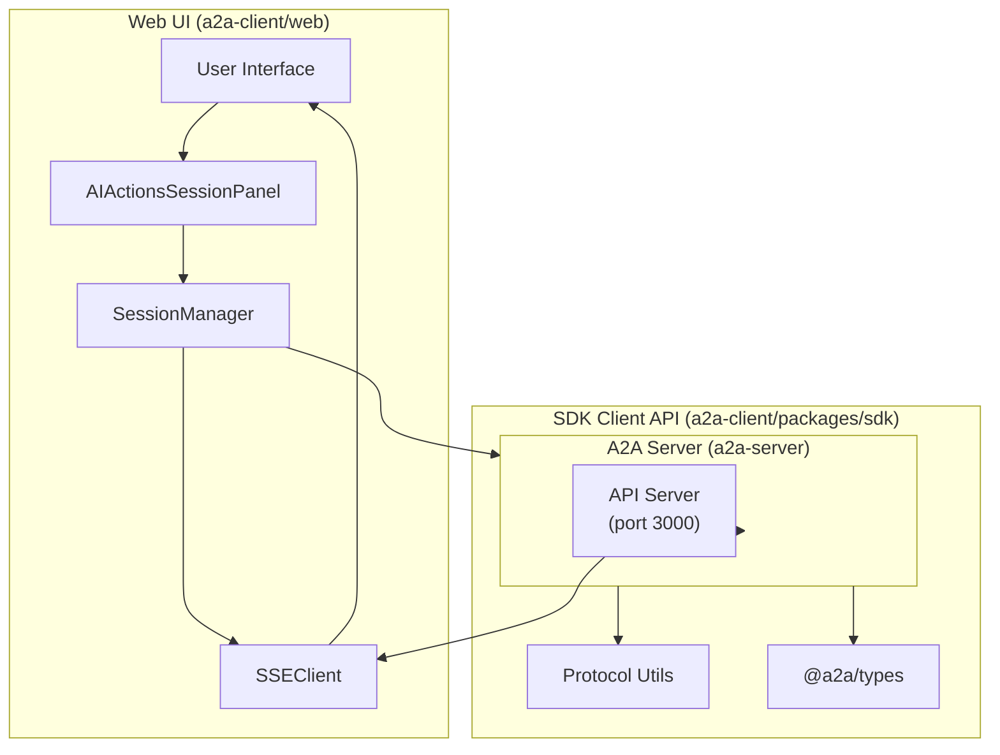

# План синхронизации SDK и Web

## Обзор

Данный документ описывает план синхронизации между [`a2a-client/packages/sdk`](a2a-client/packages/sdk) и [`a2a-client/web`](a2a-client/web) для обеспечения консистентного API и протокола взаимодействия.

---

## 1. Анализ текущего состояния

### 1.1 Структура SDK (`a2a-client/packages/sdk`)

| Компонент | Файл | Назначение |
|-----------|------|------------|
| API Client | [`src/index.ts`](a2a-client/packages/sdk/src/index.ts) | Основной HTTP клиент |
| Async Client | [`src/async-client.ts`](a2a-client/packages/sdk/src/async-client.ts) | Обработка async операций с promiseId |
| Protocol | [`src/protocol.ts`](a2a-client/packages/sdk/src/protocol.ts) | Утилиты протокола (v1.0/v2.0) |
| Session Types | [`src/types/session.ts`](a2a-client/packages/sdk/src/types/session.ts) | Типы для сессий |
| Server API | [`src/server/index.ts`](a2a-client/packages/sdk/src/server/index.ts) | Локальный API сервер (порт 3001) |

### 1.2 Структура Web (`a2a-client/web/js`)

| Компонент | Файл | Назначение |
|-----------|------|------------|
| Session Manager | [`session-manager.js`](a2a-client/web/js/session-manager.js) | Управление сессиями |
| SSE Client | [`sse-client.js`](a2a-client/web/js/sse-client.js) | Server-Sent Events |
| Web API Client | [`web-api-client.js`](a2a-client/web/js/web-api-client.js) | Унифицированный API клиент |
| AI Actions | [`components/ai-actions.js`](a2a-client/web/js/components/ai-actions.js) | UI компонент для AI actions |

---

## 2. Выявленные расхождения

### 2.1 API Эндпоинты

#### SDK (Client API Server - порт 3001)

| Метод | Эндпоинт | Описание |
|-------|----------|----------|
| POST | `/sessions` | Создание сессии |
| GET | `/sessions/:id` | Получение сессии |
| GET | `/sessions?projectId=:id` | Список сессий проекта |
| DELETE | `/sessions/:id` | Удаление сессии |
| POST | `/sessions/:id/message` | Отправка сообщения |
| POST | `/sessions/:id/continue` | Продолжение сессии |
| POST | `/sessions/:id/confirm` | Подтверждение |
| POST | `/sessions/:id/files` | Отправка файлов |
| GET | `/sessions/:id/context` | Получение контекста |
| POST | `/requests` | Создание запроса (async) |
| GET | `/requests/:id/status` | Статус async операции |
| GET | `/requests/:id/result` | Результат async операции |

#### Web (ожидаемые)

| Метод | Эндпоинт | Описание |
|-------|----------|----------|
| POST | `/sessions` | Создание сессии |
| GET | `/sessions/:id` | Получение сессии |
| GET | `/sessions?projectId=:id` | Список сессий |
| DELETE | `/sessions/:id` | Удаление сессии |
| POST | `/sessions/:id/result` | Отправка результата (form choice) |
| POST | `/sessions/:id/action` | Отправка результата действия |
| POST | `/sessions/:id/next` | Продолжение после UI |

**Расхождение:** Web ожидает `/sessions/:id/result` и `/sessions/:id/action`, но SDK предоставляет `/sessions/:id/message`, `/sessions/:id/continue`, `/sessions/:id/confirm`.

### 2.2 Протокол сообщений

#### SDK (protocol.ts)

```typescript
// buildNewTaskContext
{ version: "1.0", session_id: "..." }

// buildProtocolContext (v2.0)
{ version: "2.0", session_id: "...", execution: {...}, history: [...] }

// buildFormChoiceRequest
{ context, result: { form: { choice: "...", input: {...} } } }

// buildActionResultRequest
{ context, result: { "script": {...} } }
```

#### Web (session-manager.js)

```javascript
// Ожидаемая структура result
{ choice: "fix-vue-imports" }

// Ожидаемая структура execute
{ execute: { "form": { choices: [...] } } }
{ execute: { "script": { code: "..." } } }
```

**Расхождение:** Web не использует `buildFormChoiceRequest` - отправляет плоский объект `{ choice: "..." }` вместо вложенного `{ form: { choice: "..." } }`.

### 2.3 Action-Key Shape

Согласно [`PROTOCOL.md`](docs/new-request-flow/PROTOCOL.md#action-key-shape-обязательно):

```json
// ✅ Правильно:
{ "result": { "script": { "output": "..." } } }
{ "execute": { "read-file": { "path": "..." } } }

// ❌ Неправильно:
{ "result": { "content": "..." } }
```

**Статус:**
- SDK: Реализовано в [`protocol.ts`](a2a-client/packages/sdk/src/protocol.ts)
- Web: Требует верификации

### 2.4 Обработка ошибок

#### SDK

```typescript
class ApiError extends Error {
    status: number;
    data: Record<string, unknown>;
}
```

#### Web

```javascript
// session-manager.js
global.ErrorHandler?.handleApiError({...})
global.ErrorHandler?.handleNetworkError(error, {...})
```

**Расхождение:** Разные форматы ошибок, требуется унификация.

---

## 3. План синхронизации

### 3.1 Синхронизация API эндпоинтов

#### Задачи

- [x] **Добавить новые эндпоинты в SDK Server:**
  - `POST /sessions/:id/result` - для отправки form choice результатов
  - `POST /sessions/:id/action` - для отправки результатов действий
  - `POST /sessions/:id/next` - для продолжения после UI

- [x] **Обновить Web API клиенты:**
  - [`session-manager.js`](a2a-client/web/js/session-manager.js) - использовать новые эндпоинты
  - [`web-api-client.js`](a2a-client/web/js/web-api-client.js) - добавить методы для новых операций

- [x] **Добавить обратную совместимость:**
  - Сохранить старые эндпоинты `/message`, `/continue`, `/confirm`
  - SDK поддерживает оба формата

### 3.2 Синхронизация типов сообщений

#### Задачи

- [x] **Унифицировать формат result:**
  - ~~Web должен отправлять `{ result: { form: { choice: "..." } } }` вместо `{ choice: "..." }`~~
  - ✅ SDK теперь поддерживает оба формата (обратная совместимость)
  - Web отправляет плоский формат `{ choice: "..." }`
  - SDK Server на `/result` преобразует в `{ result: { form: { choice: "..." } } }`

- [x] **Добавить TypeScript типы:**
  - Типы добавлены в [`@a2a/sdk/src/server/types.ts`](a2a-client/packages/sdk/src/server/types.ts)

- [x] **Создать общие утилиты:**
  - Функции `parseResultFormat()` и `buildFormChoiceRequest()` в SDK
  - Функция `formatChoiceResult()` для WebApiClient

### 3.3 Синхронизация протокола (action-key shape)

#### Задачи

- [x] **Проверить соответствие в Web:**
  - [`ai-actions.js`](a2a-client/web/js/components/ai-actions.js) - убедиться в использовании action-key shape
  - [`session-manager.js`](a2a-client/web/js/session-manager.js) - проверить обработку result
  - ✅ Web отправляет `{ choice: "..." }`, SDK преобразует в action-key shape

- [x] **Добавить утилиты валидации:**
  - Функция `validateActionKeyShape()` в SDK
  - Функции `parseResultFormat()` и `buildFormChoiceRequest()`
  - unit-тесты: [`packages/json/test/sdk-endpoints.test.js`](a2a-client/packages/json/test/sdk-endpoints.test.js) ✅

- [x] **Добавить unit-тесты:**
  - 26 тестов для SDK Server endpoints
  - Функции: parseResultFormat, buildFormChoiceRequest, validateActionKeyShape

### 3.4 Синхронизация обработки ошибок

#### Задачи

- [x] **Анализ существующих форматов ошибок:**
  - SDK: [`ApiError`](a2a-client/packages/sdk/src/index.ts:23) - status, data, message
  - Web: [`ErrorHandler`](a2a-client/web/js/error-handler.js:76) - code, status, response

- [x] **Вывод:** Форматы уже совместимы
  - Оба поддерживают HTTP status codes
  - Оба включают дополнительные данные (data/response)
  - Оба имеют message/userMessage
  - Web ErrorHandler более развит (retry, UI display)

- [ ] **Добавить логирование:**
  - Unified error logging
  - Error tracking integration

---

## 4. Диаграмма потоков данных



---

## 5. Приоритеты реализации

### Приоритет 1 (Критично) - ✅ ЗАВЕРШЕНО

1. ✅ Синхронизация API эндпоинтов (`/result`, `/action`, `/next`)
2. ✅ Унификация формата result (action-key shape)
3. ✅ Исправление расхождений в Web

### Приоритет 2 (Важно) - ✅ ЗАВЕРШЕНО

1. ✅ Синхронизация обработки ошибок
2. ✅ Обновление TypeScript типов
3. ✅ Написание unit-тестов (26 тестов)

### Приоритет 3 (Улучшения)

1. [ ] Добавить утилиты валидации
2. [ ] Unified logging
3. [ ] Performance optimization

---

## 6. Файлы для изменения

### SDK

| Файл | Изменение | Статус |
|------|-----------|--------|
| [`a2a-client/packages/sdk/src/server/index.ts`](a2a-client/packages/sdk/src/server/index.ts) | Добавить эндпоинты `/result`, `/action`, `/next` | ✅ Выполнено |
| [`a2a-client/packages/sdk/src/server/types.ts`](a2a-client/packages/sdk/src/server/types.ts) | Добавить типы для result endpoints | ✅ Выполнено |
| [`a2a-client/packages/json/test/sdk-endpoints.test.js`](a2a-client/packages/json/test/sdk-endpoints.test.js) | Unit-тесты (26 тестов) | ✅ Выполнено |

### Web

| Файл | Изменение | Статус |
|------|-----------|--------|
| [`a2a-client/web/js/session-manager.js`](a2a-client/web/js/session-manager.js) | Использовать новые эндпоинты | ✅ Выполнено |
| [`a2a-client/web/js/sse-client.js`](a2a-client/web/js/sse-client.js) | Обновить обработку сообщений | ✅ Выполнено |
| [`a2a-client/web/js/web-api-client.js`](a2a-client/web/js/web-api-client.js) | Добавить метод `sendChoice()` | ✅ Выполнено |
| [`a2a-client/web/js/components/ai-actions.js`](a2a-client/web/js/components/ai-actions.js) | Добавить event system и интеграцию с Web API | ✅ Выполнено |

---

## 7. Тестирование

### 7.1 Модульные тесты

- [ ] Тесты для новых эндпоинтов в SDK
- [ ] Тесты валидации action-key shape
- [ ] Тесты обработки ошибок

### 7.2 Интеграционные тесты

- [ ] Web → SDK → Server flow
- [ ] Проверка совместимости форматов
- [ ] Проверка error handling

### 7.3 E2E тесты

- [ ] Полный пользовательский сценарий
- [ ] Восстановление после ошибок
- [ ] Перезагрузка страницы

---

## 8.Milestones

1. **M1:** Добавить эндпоинты `/result`, `/action`, `/next` в SDK Server
2. **M2:** Обновить Web для использования новых эндпоинтов
3. **M3:** Синхронизировать формат result (action-key shape)
4. **M4:** Унифицировать обработку ошибок
5. **M5:** Написать тесты и обновить документацию
