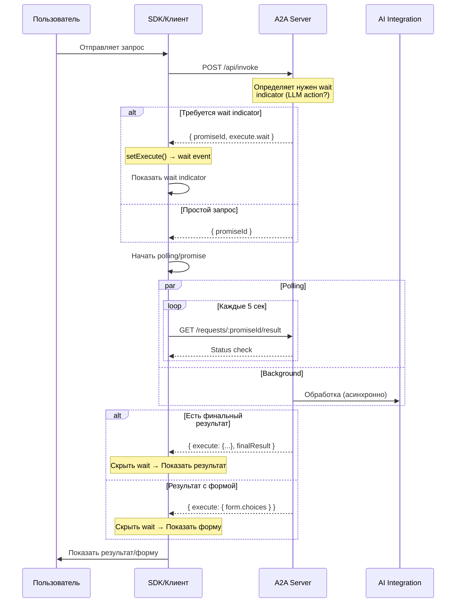

# Технический дизайн: Wait Indicator для A2A Client

## 1. Формат execute для wait indicator

### Предлагаемая структура

```typescript
// Тип WaitCommand добавляется в ExecuteCommand
interface WaitCommand {
  message: string;           // Сообщение для отображения
  showFormAfter?: boolean;   // Показывать форму после завершения (по умолчанию true)
  duration?: number;        // Опционально: ожидаемая длительность в секундах
}

// Полный формат ExecuteCommand
interface ExecuteCommand {
  form?: {
    title?: string;
    choices?: Array<{ id: string; label: string }>;
  };
  script?: {
    input: Record<string, unknown>;
    output: string;
    code: string;
  };
  message?: string;
  wait?: WaitCommand;       // НОВЫЙ ТИП
}
```

### Пример ответа сервера

```json
{
  "promiseId": "prom_1234567890_abc123",
  "execute": {
    "wait": {
      "message": "Обрабатываю запрос...",
      "showFormAfter": true
    }
  },
  "sync": false
}
```

---

## 2. Серверная реализация

### 2.1 Точка изменений: `invoke.service.ts`

**Файл:** `a2a-server/src/services/utils/invoke.service.ts:44-101`

**Изменения:**
- Добавить логику определения необходимости wait indicator
- Возвращать `{ promiseId, execute: { wait: {...} } }` для отложенной обработки

```typescript
export async function invoke(clientId: string, input: InvokeInput): Promise<InvokeResult> {
  // ... существующий код парсинга контекста ...
  
  // Определение: нужен ли wait indicator
  const needsWaitIndicator = determineWaitIndicatorNeed(context);
  
  // Создание запроса
  const { promiseId } = await requestService.create({
    clientId,
    context: ctx,
    message: message ?? null,
    codeBlocks: input.code_blocks ?? undefined,
  });

  // Если нужен wait indicator - возвращаем немедленно с execute.wait
  if (needsWaitIndicator) {
    return {
      promiseId,
      execute: {
        wait: {
          message: getWaitMessage(context),
          showFormAfter: true
        }
      }
    };
  }

  // Существующее поведение: просто promiseId
  return { promiseId };
}

function determineWaitIndicatorNeed(context: ContextBlock): boolean {
  // Логика определения:
  // - Это не sync запрос
  // - Запрос требует асинхронной обработки (LLM, AI integration)
  // - Не является простым действием (form submission без LLM)
  
  const exec = context.execution as Record<string, unknown> | undefined;
  const action = exec?.action ?? context.action;
  const llmActions = ['dialog', 'auto-ai', 'coder', 'analyze', 'task-decomposition'];
  
  // Показывать wait для LLM-действий
  return llmActions.includes(action as string);
}

function getWaitMessage(context: ContextBlock): string {
  const action = context.execution?.action ?? context.action;
  const messages: Record<string, string> = {
    'dialog': 'Обрабатываю ваш запрос...',
    'auto-ai': 'Запускаю AI агента...',
    'coder': 'Анализирую код...',
    'analyze': 'Выполняю анализ...',
    'task-decomposition': 'Разбиваю задачу на шаги...'
  };
  return messages[action as string] || 'Обрабатываю запрос...';
}
```

### 2.2 Точка изменений: `routes/index.ts`

**Файл:** `a2a-server/src/routes/index.ts:45-68`

**Текущий код:**
```typescript
// Async response with promiseId
console.log('[a2a-server] /invoke returning promiseId', { promiseId: invokeResult.promiseId });
res.json({
  success: true,
  data: {
    promiseId: invokeResult.promiseId,
    status: 'pending',
    pollUrl: `/requests/${invokeResult.promiseId}`,
  }
});
```

**Измененный код:**
```typescript
// Async response with wait indicator
console.log('[a2a-server] /invoke returning', { 
  promiseId: invokeResult.promiseId, 
  hasExecute: !!invokeResult.execute 
});

const response: Record<string, unknown> = {
  success: true,
  data: {
    promiseId: invokeResult.promiseId,
    status: 'pending',
    pollUrl: `/requests/${invokeResult.promiseId}`,
  }
};

// Добавляем execute если есть (wait indicator)
if (invokeResult.execute) {
  response.data.execute = invokeResult.execute;
}

res.json(response);
```

---

## 3. Клиентская реализация

### 3.1 Точка изменений: `session-store.js`

**Файл:** `a2a-client/web/js/session-store.js:190-228`

**Изменения в `setExecute()`:**

```javascript
SessionStore.prototype.setExecute = function(execute) {
    this._state.execute = execute || null;
    this._emit('execute', this._state.execute);

    // === НОВЫЙ КОД: Обработка wait indicator ===
    if (execute?.wait) {
        // Показываем wait indicator
        this._state.status = 'loading';
        this._emit('wait', execute.wait);
        
        // Если showFormAfter=false, не ждем форму после завершения
        if (execute.wait.showFormAfter === false) {
            this._state.pendingForm = null;
        } else {
            // По умолчанию ждем форму
            this._state.pendingForm = { type: 'wait' };
        }
        
        // Не разблокируем ввод пока wait активен
        this._state.promisePending = true;
        this._emit('promisePending', true);
        
        return this;
    }
    // === КОНЕЦ НОВОГО КОДА ===

    // Существующий код...
    // Server responded - unblock input
    this._state.promisePending = false;
    this._emit('promisePending', false);
    
    // ... остальной код без изменений
};
```

### 3.2 Интеграция с progress-indicators.js

**Файл:** `a2a-client/web/js/progress-indicators.js`

**Добавить новый метод:**

```javascript
/**
 * Показать wait indicator (модальное окно или панель ожидания)
 */
showWaitIndicator(waitConfig) {
    const { message = 'Обрабатываю...', showFormAfter = true } = waitConfig;
    
    // Создаем или обновляем tracker
    let tracker = this.get('wait-indicator');
    if (!tracker) {
        tracker = this.create('wait-indicator', {
            animated: true,
            showPercentage: false,
            showMessage: true,
            autoRemove: false
        });
    }
    
    tracker.setIndeterminate(message);
    
    // Добавляем CSS класс для модального отображения
    const container = document.getElementById('wait-indicator-container');
    if (container) {
        container.classList.add('visible');
    }
    
    return tracker;
}

/**
 * Скрыть wait indicator
 */
hideWaitIndicator() {
    const tracker = this.get('wait-indicator');
    if (tracker) {
        tracker.complete('Готово');
        this.remove('wait-indicator');
    }
    
    // Скрываем контейнер
    const container = document.getElementById('wait-indicator-container');
    if (container) {
        container.classList.remove('visible');
    }
}
```

### 3.3 Обработка в UI слое

**Новые события в SessionStore:**

```javascript
// Подписка на wait indicator
SessionStore.on('wait', function(waitConfig) {
    // Показать wait indicator
    if (window.ProgressIndicators) {
        window.ProgressIndicators.showWaitIndicator(waitConfig);
    }
});

// Переход от wait к финальному execute
SessionStore.on('execute', function(execute) {
    // Если пришел финальный execute (не wait) - скрываем wait indicator
    if (!execute?.wait && SessionStore.getState().status === 'loading') {
        if (window.ProgressIndicators) {
            window.ProgressIndicators.hideWaitIndicator();
        }
    }
});
```

---

## 4. Обработка результата после wait

### 4.1 Клиент: polling и обновление

**Поток:**
1. Клиент получает `{ promiseId, execute: { wait: {...} } }`
2. Показывает wait indicator
3. Начинает polling (как сейчас) или слушает SSE
4. При получении результата:
   - Если результат содержит `execute` (не wait) → скрыть wait, показать новый execute
   - Если результат содержит `finalResult` → завершить сессию

```javascript
// В transport или SessionStore
async function handlePollResult(promiseId) {
    const response = await fetch(`/api/requests/${promiseId}/result`);
    const data = await response.json();
    
    if (data.status === 'completed') {
        const result = data.data;
        
        // Проверяем, есть ли финальный execute
        if (result.execute && !result.execute.wait) {
            // Скрываем wait indicator
            ProgressIndicators.hideWaitIndicator();
            
            // Применяем финальный execute
            SessionStore.setExecute(result.execute);
        } else if (result.finalResult) {
            ProgressIndicators.hideWaitIndicator();
            SessionStore.setExecute({ finalResult: result.finalResult });
        }
    }
}
```

---

## 5. Логирование сессии

### 5.1 Responses лог (сырые данные)

**Хранение:** В памяти SessionStore ( `_state.responsesLog` )

```javascript
// В SessionStore constructor
this._state.responsesLog = [];
this._state.messagesLog = [];

// Добавить метод логирования
SessionStore.prototype.logResponse = function(response) {
    this._state.responsesLog.push({
        timestamp: new Date().toISOString(),
        promiseId: response.promiseId,
        hasExecute: !!response.execute,
        executeType: response.execute ? Object.keys(response.execute)[0] : null,
        raw: response  // Сырой ответ
    });
    
    // Ограничить размер лога
    if (this._state.responsesLog.length > MAX_LOGS) {
        this._state.responsesLog.shift();
    }
    
    this._emit('responseLog', this._state.responsesLog);
};
```

**Вызов:** В `applyServerResponse()`

```javascript
SessionStore.prototype.applyServerResponse = function(data) {
    // Логируем сырой ответ
    this.logResponse(data);
    
    // Существующий код...
};
```

### 5.2 Messages лог (человекочитаемые)

```javascript
SessionStore.prototype.logMessage = function(type, content, metadata = {}) {
    this._state.messagesLog.push({
        timestamp: new Date().toISOString(),
        type,           // 'user', 'assistant', 'system', 'wait', 'form'
        content,
        metadata
    });
    
    this._emit('messageLog', this._state.messagesLog);
};

// Примеры использования:
SessionStore.on('wait', function(waitConfig) {
    SessionStore.logMessage('wait', waitConfig.message);
});

SessionStore.on('execute', function(execute) {
    if (execute?.wait) {
        SessionStore.logMessage('wait', `Показываю индикатор: ${execute.wait.message}`);
    } else if (execute?.form?.choices) {
        SessionStore.logMessage('form', `Показываю форму с ${execute.form.choices.length} вариантами`);
    }
});
```

### 5.3 Доступ к логам

```javascript
// Получить все логи
SessionStore.getResponseLog();   // Массив responses
SessionStore.getMessageLog();    // Массив messages

// Очистить логи
SessionStore.clearLogs();
```

---

## 6. Готовая спецификация JSON

### 6.1 Wait Command

```json
{
  "$schema": "http://json-schema.org/draft-07/schema#",
  "type": "object",
  "properties": {
    "wait": {
      "type": "object",
      "properties": {
        "message": {
          "type": "string",
          "description": "Сообщение для отображения пользователю"
        },
        "showFormAfter": {
          "type": "boolean",
          "default": true,
          "description": "Показывать форму после завершения wait"
        },
        "duration": {
          "type": "number",
          "description": "Ожидаемая длительность в секундах"
        }
      },
      "required": ["message"]
    }
  }
}
```

### 6.2 Полный ответ сервера

```json
{
  "success": true,
  "data": {
    "promiseId": "prom_1234567890_abc123",
    "status": "pending",
    "pollUrl": "/requests/prom_1234567890_abc123",
    "execute": {
      "wait": {
        "message": "Обрабатываю запрос...",
        "showFormAfter": true
      }
    }
  }
}
```

---

## 7. Диаграмма потока данных



---

## 8. Точки изменений (сводка)

| # | Файл | Строки | Изменение |
|---|------|--------|-----------|
| 1 | `a2a-server/src/services/utils/invoke.service.ts` | 90-101 | Добавить логику wait indicator |
| 2 | `a2a-server/src/routes/index.ts` | 59-68 | Вернуть execute с wait в ответе |
| 3 | `a2a-client/web/js/session-store.js` | 190-228 | Обработка execute.wait в setExecute() |
| 4 | `a2a-client/web/js/progress-indicators.js` | Добавить методы | showWaitIndicator/hideWaitIndicator |
| 5 | `a2a-client/web/js/session-store.js` | Constructor | Добавить логирование responses/messages |
| 6 | `a2a-server/src/services/core/request-processor/request-processor.interfaces.ts` | 145-156 | Добавить тип WaitCommand |

---

## 9. Обратная совместимость

- **Существующие клиенты:** Не сломаются, так как не используют `execute.wait`
- **Сервер:** Sync режим продолжает работать как раньше
- **Прогрессия:** `progress-indicators.js` расширяется, не изменяя существующий API
